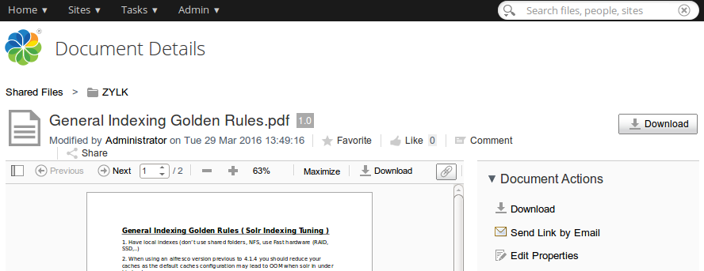

# Send Link by email action
Alfresco Share action for copying an Alfresco Link directly in your email client. The action is available in Document library and Document details action menus.

## Packaging

You may pack it with maven. Go into the directory that you unzipped, or cloned via git:

    $ git clone https://github.com/zylklab/alfresco-share-send-link-by-email
    $ cd alfresco-share-online-edition-addon
    $ mvn clean
    $ mvn package -DskipTests=true

You will generate an Alfresco Share AMP package in target directory. 

HINT: You also may download a JAR file from releases page to be deployed in $TOMCAT/shared/lib

## Installation

 - Just copy the corresponding AMP into $ALF_HOME/amps_share, stop Alfresco service, apply AMPs script ($ALF_HOME/bin/apply_amps.sh). Then start Alfresco service. 

## Screenshots

Send Link by email action:

## Links
 * https://github.com/CesarCapillas/alfresco-share-send-link-by-email/blob/master/screenshots/
 * http://goo.gl/UZa2rV (blog post)
